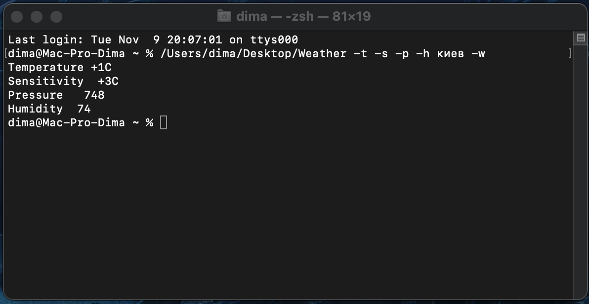

# What is the weather

To find out what the weather is in a city or country, you need to drag the binary to the console and write your city

Temperature  -t

Sensitivity  -s

Pressure     -p

Humidity     -h

Your city    -w

To request the weather in the desired city, you need to choose which parameter to display, for example -t then we feed our city 'Kiev' and add -w at the end.

While Russian city strings are supported.
